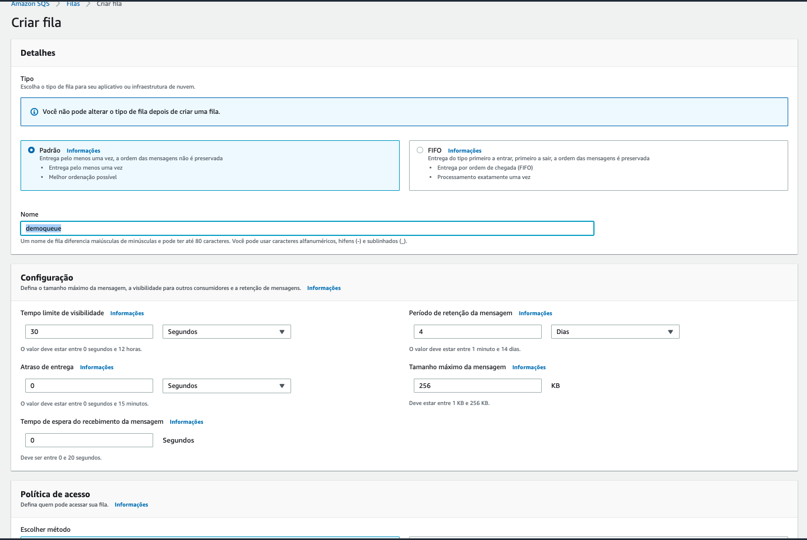
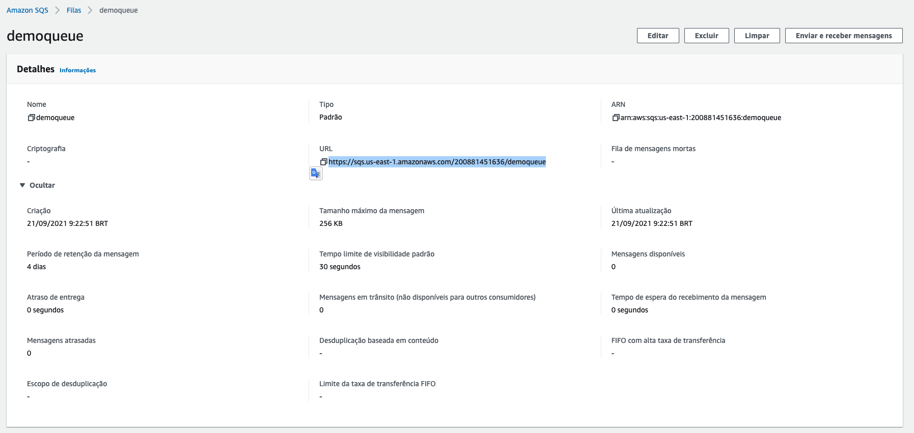
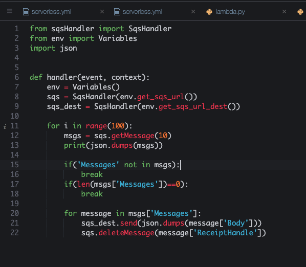

# Aula 04.1 - Standart Queue

### Criando a fila sqs
1. Crie uma fila no sqs colocando o nome 'demoqueue', deixe os valores default e clique em 'Criar Fila'

2. Copie a URL da sua fila que esta disposta conforme imagem:
    
### Enviando dados para a fila
1. No terminal do IDE criado no cloud9 execute o comando `cd ~/environment/fiap-serverless-architecture-tutorials/04-SQS/01\ -\ Standart\ Queue/` para entrar na pasta que fara este exercicio.
2. Abra o arquivo put.py com o comando `c9 open put.py`
3. Altere o arquivo put.py adicionando a URL da fila do sqs que criou nos passos anteriores

3. Execute os comandos abaixo para garantir que esta em um ambiente virtual do python com as dependencias necessárias para executar o execício:
   ``` shell
   pip3 install virtualenv && python3 -m venv ~/venv
   source ~/venv/bin/activate
   pip3 install boto3
   npm install -g serverless
   ```
4. Execute o comando `python3 put.py` no terminal para colocar 3000 mensagens na fila.


### Consumindo SQS 

1. Cria mais uma fila sqs utilizando o mesmo procedimento do exercicio anterior com o mesmo nome da anterior com o sulfixo '_dest', ficará `demoqueue_dest`
2. Execute o comando no terminal `sls create --template "aws-python3"`
3. Abra o arquivo serverless.yml com o comando `c9 open serverless.yml`
4. Altere o arquivo 'serverless.yml' e coloque o seguinte conteudo, não esqueça de preencher as duas URLs das filas como descrito:

5. Altere o arquivo 'handler.py' com o seguinte conteudo. O abra com o seguinte comando `c9 open handler.py`

7. rode o comando `sls deploy`
8. Coloque alguns itens na fila com o comando `python3 put.py`, lembrando que cada execução do lambda criado pode consumir até 1000 posições da fila sqs.
9. Para execução do lambda rode o comando `sls invoke -l -f sqsHandler` no terminal
10. Enquando espera o comando terminar pode observar no painel do SQS as mensagens se movendo a cada atualização manual pelo canto direito superior. Lembre que cada execução move 1000 por definição no código. [Link para painel SQS](https://console.aws.amazon.com/sqs/v2/home?region=us-east-1#/queues)
    
11. Vá ver a regra contruida para rodar o lambda a cada 5 minutos.Para isso em uma nova aba vá ao console do cloudwatch. Clique em  'Regras' no menu lateral.

12.  Se esperar alguns execuções vai ver que a fila principal vai zerar.
13.  Execute o comando `sls remove` no terminal para remover o que foi criado.
14.  Vá até o painel do sqs, selecione as 2 filas que utilizou no exercicio, clique em 'Ações de fila' e depois em 'Eliminar Filas'. Confirme. Essa ação vai tirar todos os items das 2 filas.
