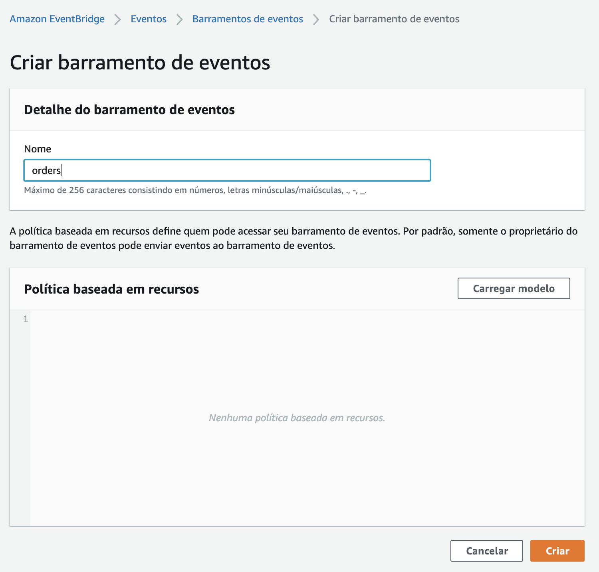
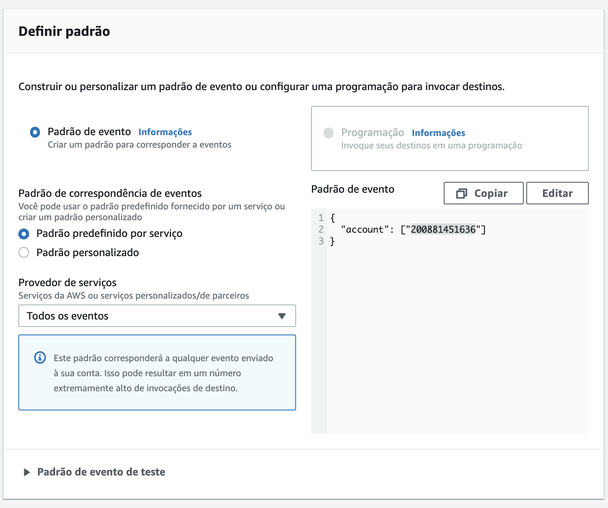
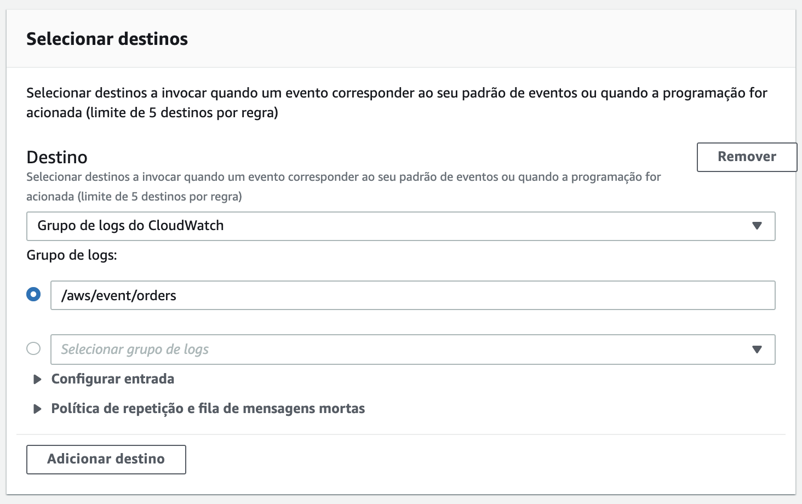

# Aula 06.1 - EventBridge

1. No terminal do IDE criado no cloud9 execute o comando `cd ~/environment/fiap-serverless-architecture-tutorials/06-EventBridge/` para entrar na pasta que fara este exercicio.
2. Utilize virtualenv para esse exercicio com os comandos:
   ``` shell
      python3 -m venv ~/venv 
      source ~/venv/bin/activate
   ```
3. Em uma nova aba do console aws entre no serviço 'EventBridge'
4. Do lado esquerdo da tela clique em `Barramento de eventos`
5. No canto direito inferior da tela clique em `Criar barramento de eventos` 
   
6. Coloque o nome `Orders` no barramento, deixe a política vazia e clique em `Criar`
   
7. No menu lateral esquerdo clique em `Regras`
8. Certifique-se de que o barramento `Orders` esta selectionado e clique em `Criar Regra` Para criar uma regra que irá capturar todos os eventos do barramento Orders e mandar uma log dentro do Cloudwatch Logs.
   
9. Na página de criação da regra adicione o seguinte na seção Nome e Descrição:
   1. Nome: `OrdersDevRule`
   2. Descrição: `Catchall rule for development purposes`
   
10. Na seção Definir Padrão adicione o seguinte:
    1. Selecione `Padrão de evento`
    2. Em `Padrão de correspondência de eventos` escolha `Padrão predefinido por serviço`
    3. Em `Provedor de serviços` selecione `Todos os evento`
   
11. Em `Selecionar barramento de eventos` certifique de que `Orders` esta selecionado.
12. Na seção `Selecionar destinos` adicione o seguinte:
    1. Em `Destino` escolha `Grupo de logs do Cloudwatch`
    2. Em `Grupo de logs` coloque o valor `/aws/event/orders`
   
13. Clique em `Criar` ao final da página.
14. Hora de testar a regra criada. Para tal, retorne ao Cloud9.
15. Abra o arquivo putEvents.py com o comando `c9 open putEvents.py`
16. Você vai alterar o arquivo para que envie eventos para o recém criado barramento Orders. Note que o evento tem metadados como detalhe de evento, fonte e Hora, assim como o evento em si que fica em detalhe. 
17. Altere o arquivo para que fique como na imagem abaixo, não esqueça de salvar:
   
18. No terminal execute o comando `python3 putEvents.py` para enviar 10 eventos para o barramento.
19. Para conferir a regra funcionando vá para o painel do cloudwatch utilizando o link: [Cloudwatch Logs](https://console.aws.amazon.com/cloudwatch/home?region=us-east-1#logsV2:log-groups/log-group/$252Faws$252Fevents$252Forders)
20. Caso tudo tenha corrido corretamente terão alguns streamings como na imagem abaixo:
    
21. Clique em um dos streamings para ver o evento enviado.
    
22. Devolta ao cloud9 agora você vai criar outras 2 regras que ativaram cada uma um lambda. Isso será executado com serverless framework apontando para o barramento que criou. Para entrar na pasta correta e abrir o arquivo no IDE execute o comando:
``` shell
cd ~/environment/fiap-serverless-architecture-tutorials/06-EventBridge/lambda
c9 open serverless.yml
```
23. <strong>Adicione</strong> as 2 funções lambda conforme na imagem abaixo o serverless.yml aberto no passo anterior. A função `source` captura todos os eventos que tem o source = `com.aws.orders`, já a segunda função, `detail`, captura todos os eventos do mesmo source e adiciona os filtros por tipo de detalhe e localização.
    
24. No terminal execute o comando `sls deploy --verbose` para fazer o deploy das funções e criar as regras no eventBridge. A opção --verbose no comando é para visualizar os passos executados pelo cloudformation durante o deploy.
25. Publique eventos no barramento utilizando localizações diferentes utilizando o arquivo `putRandomEvents.py`. Para tal execute os comandos abaixo:
``` shell
cd ~/environment/fiap-serverless-architecture-tutorials/06-EventBridge/
python3 putRandomEvents.py
```
26. Verifique os logs dos lambdas nos seguintes links:
- [source](https://console.aws.amazon.com/cloudwatch/home?region=us-east-1#logsV2:log-groups/log-group/$252Faws$252Flambda$252Fevent-filter-dev-source)
- [detail](https://console.aws.amazon.com/cloudwatch/home?region=us-east-1#logsV2:log-groups/log-group/$252Faws$252Flambda$252Fevent-filter-dev-detail)
